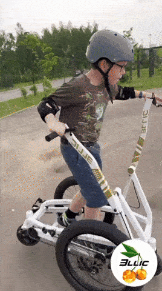
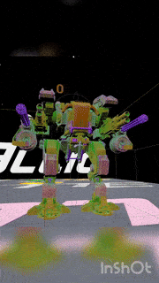
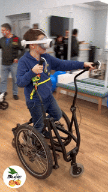
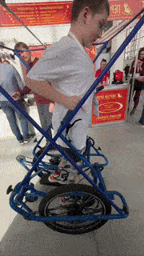

# ELLIC

### Open Locomotion Platform & Future MechSport League

**Ellic** is an open research platform exploring a new class of human-scale locomotion mechanisms.

Our long-term dream is ambitious:

> Build a global **mech sport league** as exciting and profitable as Formula-style racing — powered by open robotics and human-piloted machines.

The Ellic platform is the first step.

It combines mechanical locomotion, robotics, VR interaction, and competitive gameplay into a new form of sport and engineering culture.

---

---

# The Vision

Imagine a new type of championship.

Human pilots ride mechanical walking machines.

Teams design their own vehicles based on a shared open platform.

Matches happen in both **physical arenas and virtual environments**.

Fans follow teams, players, and machines just like traditional motorsport.

There are tournaments, leagues, and world cups.

Collectors trade digital artifacts, machine skins, and historical cards of legendary matches.

Sponsors support teams.

Betting platforms analyze performance.

And millions watch the evolution of a new sport.

That is the long-term vision of the **Ellic MechSport League**.

---

---

# Why Open Source?

Great technological cultures grow around **open platforms**.

We believe the fastest way to build a new sport is to let the world participate.

This repository contains the foundations of the Ellic platform:

* locomotion mechanism research
* CAD models and prototypes
* control firmware
* robotics interfaces
* VR and simulation experiments
* documentation and engineering notes

Our goal is simple:

**let anyone build, improve, and compete.**

---

---

# The Current Prototype

The current experimental machine is an **elliptical walking scooter mechanism**.

It is a compact human-scale locomotion device combining:

* mechanical walking kinematics
* electric drive
* robotic control systems
* interactive VR integration

The design aims to create a new category between:

* scooter
* exoskeleton
* robotic vehicle

The result is a **human-piloted locomotion platform**.

---

# The Long-Term Goal

We are not just building a machine.

We are building an **ecosystem**.

Future stages include:

**1. Open Hardware Platform**

Builders around the world replicate and modify the Ellic mechanism.

**2. Experimental Competitions**

Small community tournaments begin to appear.

**3. VR Integrated Matches**

Physical locomotion interacts with digital battle environments.

**4. Team Culture**

Engineering teams design their own machines and strategies.

**5. Media Championship**

A global mech sport league emerges.
---

---

# The Community

This repository is the starting point for a global builder community.

You can participate as:

* teams
* engineer
* roboticist
* designer
* game developer
* mechanical builder
* VR developer
* sponsor
* fan

Or simply someone curious about the future of robotics and sport.

---

# What We Share

This repository will gradually include:

* CAD models
* firmware
* robotics interfaces
* VR experiments
* simulation tools
* research notes
* competition ideas

The intention is to **make replication possible**.

If you want to build your own machine — the resources will be here.

---

# How To Join

There are many ways to participate.

### Builders

Try building your own Ellic machine.

### Engineers

Improve the mechanism, firmware, or control systems.

### Game Developers

Help create VR environments and competitive mechanics.

### Researchers

Explore locomotion, biomechanics, and robotics control.

### Media Creators

Document the evolution of the machines.

### Sponsors

Support early tournaments and teams.

---

# Future Competitions

The ultimate goal is to create a new kind of championship.

Possible formats include:

* mech racing
* arena duels
* VR combat tournaments
* team challenges
* endurance competitions

Each machine, team, and pilot becomes part of the sport’s evolving history.

---
# Supporting the Project

Developing hardware platforms takes time and resources.
One way to support the project is to acquire an early assembled Ellic prototype.

We are preparing a small number of fully assembled machines that teams can purchase.

Price: ≈ 1M RUB ($20k) 
Research machine founder edition 15.

Gettin one allows you to:
- Save significant engineering time
- test control immediately
- develop XR competition concepts
- bit mythology of the future sport.

---
# Your support to organize comunity competitions.

If you believe in the idea of a new robotic sport:

* star the repository
* contribute ideas or code
* share the project
* support development
* build your team

Early supporters help shape the foundation of an entirely new competitive ecosystem.

---

# The Beginning

Every major sport began with a few experimental machines and a handful of enthusiasts.

Today motorsport fills stadiums.

Esports fill arenas.

Robotics will follow.

This repository is the beginning of that journey.

If you want to help build the future of mech sport:

**join us.**
