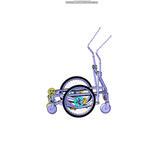
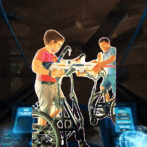

# ELLIC
Research open platform of locomotion Эллипс - велик - эллик
The project explores modern walking mechanisms for robomobility devices, mechs and rehabilitation technologies.

Goal:
develop usable locomotion mechanisms
for people and mobility activities.

Current prototype:
elliptical walking scooter mechanism.

## Demo


## Concept

ELLIC explores elliptical locomotion mechanisms.

Instead of classical wheel or leg walking systems, the mechanism generates a cyclic elliptical trajectory that allows continuous stepping motion.

Potential applications:

- robotic locomotion research
- rehabilitation mobility devices
- experimental vehicles


## Mechanical concept




## VR simulation


## ROS simulation

```markdown



## VR robot experiment


## Video

[Watch experiment video](ros/description/video_2025-11-05_14-38-01.mp4)


## Repository structure


---

## 7. Hardware

```markdown
## Hardware

Current prototype includes:

- elliptical walking mechanism
- ESP32 control electronics
- motor drivers
- sensors


## Research directions

- non-circular locomotion systems
- human powered mobility devices
- robotic walking mechanisms
- rehabilitation locomotion devices


## Contributing

The project is open for collaboration.

Possible contributions:

- mechanical design
- robotics control
- ROS simulation
- VR interfaces


## License

TBD


