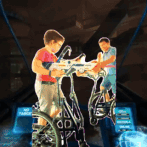
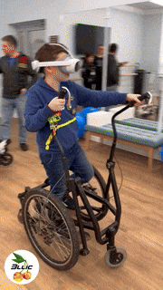
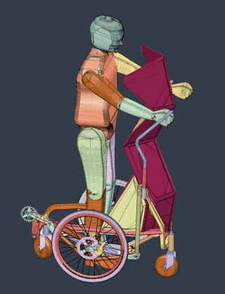
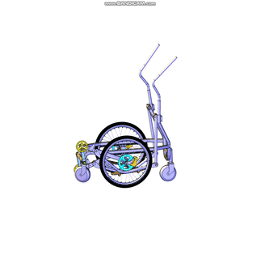
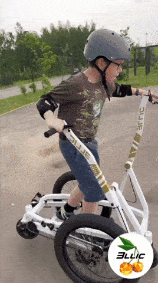
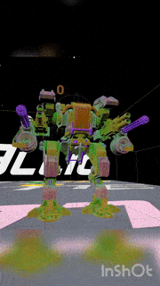
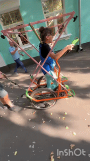

# 🤖 ELLIC 🚶‍♂️

Мы делаем экспериментальный формат медиалиги мех-спорта, где команды строят человекоуправляемые машины и участвуют в боях в дополненной реальности ⚔️

<table> 
  <tr> 
   <td>  </td> 
  </tr> 
</table>

Как BattleBots, только ты внутри мехбота 🤯  
Ты ходишь в механическом экзоскелете и дерёшься в AR.

🔬 Это открытый инженерный эксперимент - смесь спорта, игры и инженерного челленджа 🎮⚙️

Для создания мехботов используется платформа ELLIC, где пилот шагает внутри машины, а сам мехбот по цене сопоставим с электровелосипедом 🚲  

<table>
  <tr>
    <td></td>
    <td></td>
  </tr>
</table>

В этом репозитории выложены наши разработки, необходимые для создания своего мехбота, и описан экспериментальный формат соревнований в дополненной реальности 📦  

---

# 🧩 Платформа состоит из трёх составляющих:

---

## 1. ⚙️ Физическая платформа. Модели и рабочая документация собраны в ⚙️ [cad/](cad/)

За основу взят эллипс из тренажёрного зала, поставлен на колёса — теперь в нём можно шагать и кататься 🏃‍♂️

- [cad/MECHANISM.md](cad/MECHANISM.md) — описание устройства
  
- [cad/BUILD_ONE](cad/BUILD_ONE.md)  — описание сборки  

Содержимое репозитория:
- a. В репозитории представлены модели Ellic версии 14 в формате Fusion, SolidWorks, STEP  
- b. В папке **Дизайн** представлена модель фронтального обвеса мехбота  
- c. По запросу может быть предоставлена документация для сборки в формате ЕСКД 📄  
- d. Weapon 🔫  
  - виртуальные орудия (как сейчас)  
  - планируются пневматические пушки, стреляющие безопасными снарядами (например, для бассейна) 💦  
  - возможны роборуки для манипуляций, если мы придумаем для них правила 🤖  

---

## 2. 🔌 Электроника. Управляющее программное обеспечение в 📟 [firmware/](firmware/)

- моторы, помогающие движению ⚡  
- датчики момента (усилия на рычагах)  
- энкодер положения вала  
- датчики тока  
- джойстик 🎮  
- система управления (ESP32)  

Содержимое репозитория:
- a. Исходный код прошивки для управления моторами с джойстика 💻  

---

 ## 3. 🥽 [VR / AR лежит здесь:](https://github.com/loguluk/ELLIC)

VR-гарнитура для проведения битвы мехботов в формате дополненной реальности — с виртуальным или реальным противником 👾  

Содержимое репозитория:
- a. Исходный код на Unreal Engine 5.3 (в `.zip`)  
- b. `.apk` для PICO 4 (AR, технология see-through)  
  - бой с виртуальным противником  
  - стрельба ведётся тем же джойстиком, что управляет скутером 🔫  
- c. Папка **Чемп** — проект правил соревнований и безопасности 📜  

---

## Прочие материалы

## 🤖 Моделирование 📊 simulation/

Разделы для моделирования в среде:
- ROS  
- URDF  
- Webots  

Пока там только первые тесты и ничего финального 🧪  

---

## 🔬 Research 📝 [research/](research/) 

Материалы исследований по разным направлениям:
- a. Отчёт по гранту Фонда содействия инновациям  
- b. Медицинские исследования и гипотезы 🧠

 

[История проекта здесь](docs/history/ellicDevHistory.md).

---

## 👥 Community [community/](community/)

[START_A_TEAM](community/START_A_TEAM.md) - принципы формирования и вознаграждения команд медачемпионата

---

# ❓ Зачем тебе сюда

- хочешь построить меха → тебе сюда 🤖  
- хочешь участвовать в шоу → тебе сюда 🎬  
- хочешь просто играть → пока рано ⏳  

---

# ❗ Будет сложно, но мы поможем

В командах приветствуются навыки и оборудование:

- Производство медиаконтента 🎥  
- Знание Unreal Engine или Unity (как плюс, но не обязательно 🎮)  
- Геймдизайн  
- Работа с металлом (резка, сверление, сварка, лазер, гибка), механическая сборка 🔩  
- ESP32 или аналоги  
- знание велокомпонентов (как плюс 🚴)  

---

## ⚠️ Безопасность [chemp/Safety_rules.pdf](CHEMP/Safety_rules.pdf)

Мы тестируем систему и вводим правила безопасности, но это всё ещё экспериментальная техника ⚠️  

Всегда тестируйте:
- на низкой скорости  
- с доступной аварийной остановкой 🛑  

---

Это первый прототип реального мехспорта, и нет гарантии, что всё сразу будет работать идеально, но если это сработает хотя бы частично, вы получите:

- опыт создания реального мехбота: механика, электроника и интеграция с VR 🤖  
- эмоции от управления реальным мехом в бою 🔥  
- место в создании нового медиапродукта на стыке MEDIA – STEM – VR 🚀  

---

# 🎯 Цель

Сформировать в 2026 году 3–4 команды и провести экспериментальный медиачемпионат битвы мехботов:
проект правил здесь [chemp/](CHEMP/)

- чемпионат на вылет  
- 2 меха на спортивной площадке  
- бой в дополненной реальности  
- параллельная трансляция:  
  - физического мира  
  - AR-сцены 📡  

Мы можем предоставить готовые машины для соревнований. Машины могут быть доработаны командами по согласованному регламенту (мы за интересный и зрелищный движ) 😎  

[**MANUAL**](docs/Manual_EllicV14_EN.pdf)

Команды могут строить мехботов самостоятельно. При необходимости мы можем предоставить отдельные сложные детали (рамы, тяги, рычаги) 🏗️  
[cad/BUILD_ONE](cad/BUILD_ONE.md) 

---

## 🚀 Как вписаться без боли

**Быстрый вход (без сборки меха):**

- мы даём готовые машины  
- можно прийти и тестировать  
- можно просто участвовать как пилот 🧑‍🚀  
- можно зайти как команда без инженерки  

Смотри подробнее в [community/START_A_TEAM](community/START_A_TEAM.md) 📄  

---

## 🎁 Что ты реально получишь

- участие в первом прототипе мехспорта  
- видео / медиа с боя 🎥  
- опыт пилотирования меха  
- возможность стать частью команды-основателя 🤝  

---

## 📫 Контакты

Я — Дмитрий Логунов. Раньше занимался автоматизацией в госсекторе и промышленности. Несколько лет со своими сыновьями я делаю Ellic — платформу, на которой человек шагает внутри машины 🤖  

Это не идеальная система и не готовый продукт, а живая разработка, которую мы ведём прямо сейчас 🔧  

Проект развивается в рамках ООО «Движ.Тех» — небольшой компании, занимающейся образовательной робототехникой и экспериментальными платформами 🏢  

Проект поддержан Фондом содействия инновациям 💡  

📧 dselog@gmail.com

[START_A_TEAM](START_A_TEAM.md)

<a href="https://github.com/yourusername/yourrepo/stargazers" target="_blank" style="text-decoration:none;">
  <kbd>⭐ Star the repository</kbd>
</a>

<a href="https://github.com/yourusername/yourrepo/fork" target="_blank" style="text-decoration:none;">
  <kbd>🔧 Fork the project</kbd>
</a>

<a href="https://github.com/yourusername/yourrepo/issues" target="_blank" style="text-decoration:none;">
  <kbd>💡 Open issues with ideas</kbd>
</a>

<a href="https://twitter.com/intent/tweet?text=Check+out+this+project+on+GitHub&url=https://github.com/yourusername/yourrepo" target="_blank" style="text-decoration:none;">
  <kbd>📢 Share the project</kbd>
</a>

---

