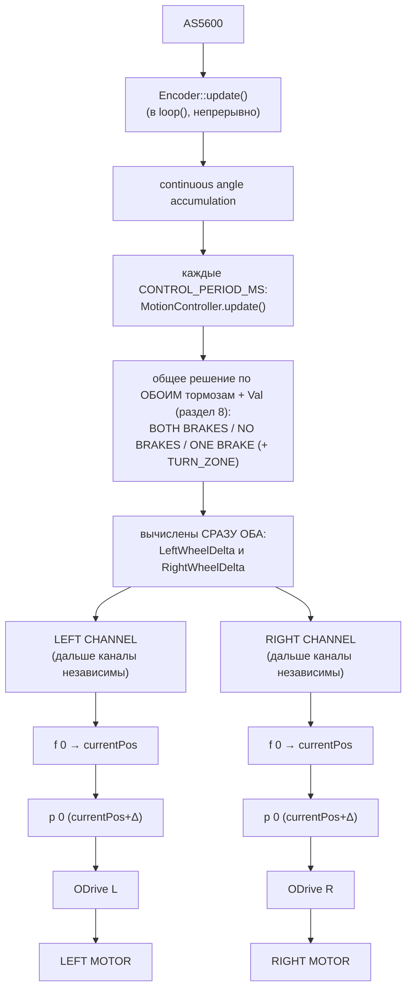
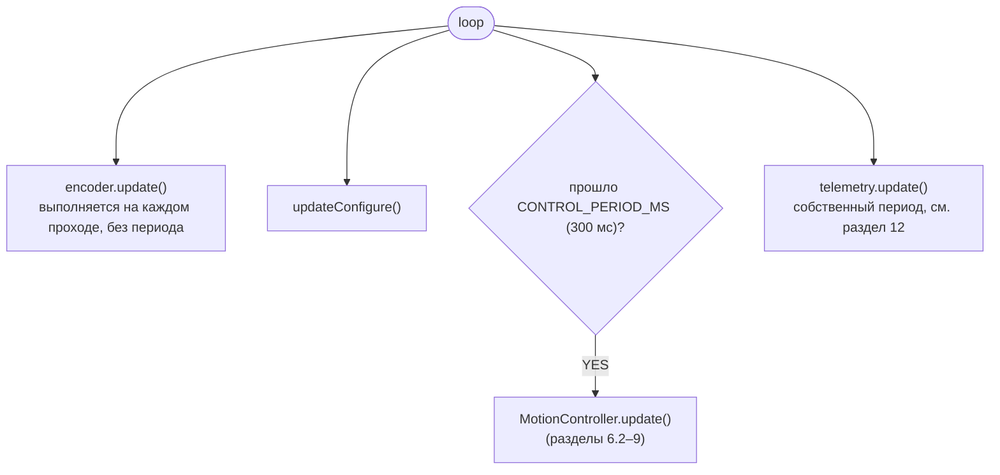
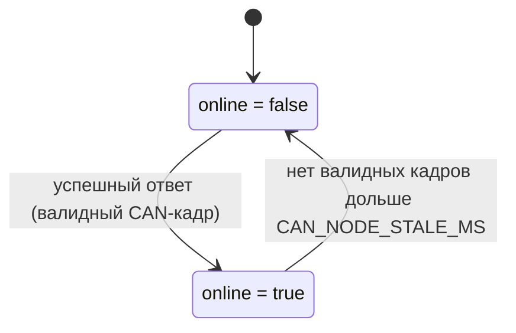
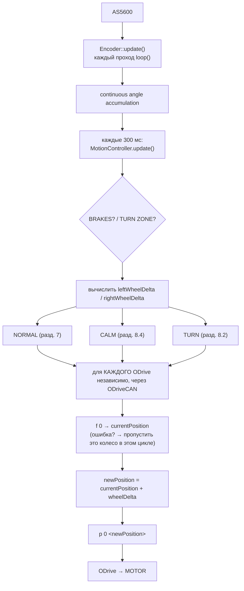

# Спецификация системы управления ELLIC (ESP32 + AS5600 + 2×ODrive)

**Прошивка ODrive:** v0.5.6, odesc 4.2

**Протокол связи с ODrive:** CAN Simple

> Это нормативный документ: здесь только то, чему код обязан соответствовать
> (алгоритм, константы, форматы команд, аппаратные подключения, принятые
> архитектурные решения), плюс минимум контекста, без которого правило
> непонятно. Аудиты, открытые вопросы, планы работ и история их исследования
> вынесены в отдельный документ — `ELLIC_worklog.md`. Если раздел здесь
> ссылается на нерешённый вопрос — смотри worklog, не додумывай поведение
> самостоятельно.

---

## 0. Модули и файлы

Система состоит из следующих модулей. Каждый модуль реализован в виде пары файлов .h / .cpp с соответствующим именем. В коде и спецификации используются только эти названия.

| **Модуль** | **Файлы** | **Назначение** |
|---|---|---|
| **Encoder** | Encoder.h / Encoder.cpp | Работа с AS5600: чтение raw-угла, вычисление continuousAngle, обновление в каждом loop() |
| **MotionController** | MotionController.h / MotionController.cpp | Логика движения: расчёт ValDelta, состояние тормозов, вычисление leftWheelDelta / rightWheelDelta, вызов раз в 300 мс |
| **ODriveCAN** | ODriveCAN.h / ODriveCAN.cpp | Единственный модуль, обращающийся к CAN-шине ODrive. Обслуживает два ODrive по их node_id, содержит данные текущей позиции и скорости LEFT WHEEL / RIGHT WHEEL, кэш диагностики и состояние online. |
| **Telemetry** | Telemetry.h / Telemetry.cpp | Сбор снапшотов у всех модулей, буфер логов, вывод в Serial. Никогда не обращается к ODriveCAN напрямую |
| **main.cpp** | main.cpp | Точка входа: setup() и loop(). Связывает модули и вызывает их методы по расписанию |

**Важно:**

- В коде и архитектуре **не используются** другие классы/модули для тех же функций, например OdriveChannel, ODrive, MotorController и т.п.
- ODriveCAN — единственный владелец CAN-шины ODrive. Все обращения к ODrive выполняются через него.
- Telemetry не обращается к ODrive напрямую, а только получает данные через ODriveCAN.
- main.cpp содержит один экземпляр ODriveCAN. ODriveCAN обслуживает два логических канала: RIGHT → node_id = 1; LEFT → node_id = 2.
- Этот раздел является **нормативным**: расхождение фактической структуры кода с данным списком считается нарушением спецификации.

---

## 1. Физическая модель

- Есть один механический вал с датчиком **AS5600** (абсолютный энкодер, 0...360°).
- Вал через шагающий механизм (коленвал → шатуны → тяги → оси колёс на каретках, движущихся по направляющим) связан с двумя мотор-колёсами.
- Каждое мотор-колесо управляется своим **ODrive** (LEFT / RIGHT).
- Левый и правый тормоза позволяют независимо фиксировать соответствующее колесо.
- `MOTOR_GEAR_RATIO = 4.4` — передаточное число редуктора: чтобы колесо на выходе сделало ровно 1 оборот, мотор (вал ODrive) должен провернуться в 4.4 раза больше.
- Разрешение Hall-датчика мотора (42 такта/оборот) в коде **не используется** и для расчётов не нужно.

**Главный принцип:** вал — единственный источник движения. ESP32 сам движение не генерирует. Человек двигает вал → ESP32 пересчитывает это в движение колёс.

---

## 2. Архитектура: общее решение по тормозам + независимые CAN-каналы

ESP32 — один контроллер. Важно не путать два разных уровня независимости:

- **Расчёт приращений (`leftWheelDelta` / `rightWheelDelta`) — НЕ независим по каналам.** Это одно общее решение на каждый цикл управления: оно смотрит на состояние **обоих** тормозов сразу и на общий `Val` (раздел 8) и по результату сразу определяет оба приращения — левое и правое — вместе. Разложить этот шаг на отдельную "левую" и отдельную "правую" логику нельзя: например, при нажатом только левом тормозе именно это единое решение обнуляет `leftWheelDelta` и одновременно выставляет `rightWheelDelta = TURN_STEP × RIGHT_WHEEL_SIGN`.
- **Обмен с RIGHT и LEFT выполняется через общий модуль ODriveCAN, но логические каналы RIGHT и LEFT остаются независимыми.** RIGHT определяется node_id = 1. LEFT определяется node_id = 2. Ошибка или отсутствие ответа RIGHT не блокирует работу LEFT. Ошибка или отсутствие ответа LEFT не блокирует работу RIGHT.

**Схема (как в исходном документе):**

```
AS5600
│
▼
Encoder::update() (в loop(), непрерывно)
│
▼
continuous angle accumulation
│
▼
каждые CONTROL_PERIOD_MS:
MotionController.update()
│
▼
общее решение по ОБОИМ тормозам + Val (раздел 8):
BOTH BRAKES / NO BRAKES / ONE BRAKE (+ TURN_ZONE)
│
▼
вычислены СРАЗУ ОБА: LeftWheelDelta и RightWheelDelta
│
┌────────┴────────┐ ← дальше каналы независимы
▼                 ▼
LEFT CHANNEL      RIGHT CHANNEL
│                 │
▼                 ▼
f 0 → currentPos  f 0 → currentPos
│                 │
▼                 ▼
p 0 (currentPos+Δ) p 0 (currentPos+Δ)
│                 │
▼                 ▼
ODrive L          ODrive R
│                 │
▼                 ▼
LEFT MOTOR        RIGHT MOTOR
```

**Та же схема в формате mermaid:**



---

## 3. Переменные и терминология

Используем только те объекты/переменные, которые реально существуют в коде.

| Объект | Переменная | Смысл |
|---|---|---|
| Val | raw-угол AS5600 | 0...360°, читается напрямую с датчика |
| Val | continuous angle | накопленный (безразрывный) угол вала |
| Val | `ValDelta` | изменение continuous angle между двумя циклами `MotionController.update()` |
| LeftWheel | `leftWheelDelta` | приращение, которое отправляется на ODrive L (в оборотах вала мотора ODrive, до редуктора) |
| RightWheel | `rightWheelDelta` | приращение, которое отправляется на ODrive R |
| ODrive (L/R) | `currentPosition` | позиция, читаемая с ODrive командой `f 0` перед каждой отправкой |

Накопленной цели (target) в ESP32 **нет** — новая команда всегда строится от позиции, реально считанной у ODrive в этом цикле. Если очередная дельта не была учтена (пропуск цикла и т.п.), она просто теряется — накопления ошибки не происходит.

---

## 4. Аппаратные подключения (ESP32)

**AS5600 (I²C):**

| Сигнал | Пин |
|---|---|
| SDA | GPIO21 |
| SCL | GPIO22 |
| I²C clock | 50 кГц (`Wire.setClock(50000)`, значение по умолчанию) |

**Тормоза:**

| Сигнал | Пин | Режим |
|---|---|---|
| LEFT_BRAKE_PIN | GPIO32 | `INPUT_PULLUP` |
| RIGHT_BRAKE_PIN | GPIO33 | `INPUT_PULLUP` |

Тормоз считается **нажатым** при `digitalRead(pin) == LOW` (активный уровень — LOW, за счёт pull-up).

**CAN:**

- ESP32: встроенный TWAI controller
- CAN transceiver: SN65HVD230
- CAN-шина: CAN_H / CAN_L
- Оба ODrive подключены к одной физической CAN-шине.
- ODrive RIGHT: node_id = 1
- ODrive LEFT: node_id = 2

Пины TWAI (см. также раздел 15, "Итого зафиксировал в спецификации"):

| Сигнал | Пин |
|---|---|
| CAN TX | GPIO16 |
| CAN RX | GPIO17 |

CAN bitrate = 250000 бит/с.

---

## 5. Константы

| Константа | Значение | Назначение |
|---|---|---|
| `CONTROL_PERIOD_MS` | **300 мс** | период вызова `MotionController.update()` |
| `MOTOR_GEAR_RATIO` | 4.4 | передаточное число редуктора |
| `TURN_ZONE_DEG` | 10.0° | ширина зоны вокруг 180° и 0°/360°, где разрешён поворот |
| `TURN_STEP` | 0.03 (оборота мотора ODrive) | величина приращения противоположного колеса при повороте |
| `LEFT_WHEEL_SIGN` | +1.0 | знак канала LEFT |
| `RIGHT_WHEEL_SIGN` | −1.0 | знак канала RIGHT (моторы установлены зеркально) |
| `Telemetry.periodMs` | 150 мс | период запуска цикла сбора телеметрии (см. раздел 12) |
| `Telemetry.printPeriodMs` | 100 мс | период вывода в Serial (~10 Гц) |
| `CAN_NODE_STALE_MS` | 300 мс | время ожидания CAN |

---

## 6. Вычисление ValDelta

### 6.1. На уровне энкодера

(`Encoder::update()`, вызывается в каждом проходе `loop()`, без привязки к `CONTROL_PERIOD_MS`)

```
delta = currentRawAngle − previousRawAngle
если delta > 180°: delta -= 360°
если delta < −180°: delta += 360°
continuousAngle += delta
```

Коррекция перехода через 0°/360° обязательна, иначе переход трактуется как скачок на ~360° вместо реального малого перемещения:

- 359° → 1° ⇒ +2° (а не −358°)
- 1° → 359° ⇒ −2° (а не +358°)

### 6.2. На уровне контроллера движения

(`MotionController.update()`, раз в `CONTROL_PERIOD_MS`)

```
ValDelta = ValContinuousAngle_now − ValContinuousAngle_previous_control_cycle
```

`ValDelta` — это суммарное изменение вала **между двумя циклами управления** (каждые 300 мс), а не между двумя соседними чтениями AS5600 (они происходят чаще).

### 6.3. Обработка ошибок AS5600

При ошибке чтения I²C с AS5600 (`Wire.requestFrom()` возвращает менее 2 байт):

- `continuousAngle` НЕ обновляется;
- `previousRawAngle` НЕ обновляется;
- функция возвращает последнее валидное значение датчика;
- ошибка логируется в `Telemetry` с уровнем `LogLevel::WARNING`.

Ошибка чтения не должна интерпретироваться как изменение угла. Значение `0°` является валидным значением AS5600 и НЕ используется как признак ошибки чтения.

Ошибки AS5600 не обрабатываются автоматически системой — ни как аварийная остановка, ни как сброс `continuousAngle`, ни как переход в отдельное аварийное состояние. Обоснование: управление построено на приращениях (`ValDelta`), а не на абсолютном значении `continuousAngle` как команде положения. Единичный сбой чтения не накапливается:

- при ошибке чтения `continuousAngle` остаётся неизменным;
- `previousRawAngle` остаётся неизменным;
- после восстановления связи следующее валидное чтение корректно продолжает накопление угла;
- отдельного ложного приращения из-за самого факта ошибки чтения не возникает.

При этом система не выполняет автоматическую коррекцию возможного медленного дрейфа `continuousAngle`, если датчик при физически неподвижном вале выдаёт изменяющиеся валидные значения. Такой дрейф потенциально может приводить к соответствующему `ValDelta` и, следовательно, к движению колёс. Этот риск принят как осознанное ограничение архитектуры: автоматической компенсации дрейфа, фиксации нулевой точки, остановки обоих ODrive или перехода в отдельное аварийное состояние не предусмотрено. Контроль в такой ситуации осуществляется пилотом через тормоза (раздел 8) и выключение питания.

---

## 7. Базовое (нормальное) движение — если ни один тормоз не нажат

```
leftWheelDelta  = ValDelta × MOTOR_GEAR_RATIO / 360 × LEFT_WHEEL_SIGN
rightWheelDelta = ValDelta × MOTOR_GEAR_RATIO / 360 × RIGHT_WHEEL_SIGN
```

Знаки каналов компенсируют зеркальную установку моторов: при одном и том же `ValDelta` колёса должны крутиться в геометрически противоположные стороны.

---

## 8. Логика тормозов и поворота

Порядок проверок на каждом цикле **фиксирован**:

1. оба тормоза нажаты
2. ни один тормоз не нажат
3. нажат только левый тормоз
4. нажат только правый тормоз

В ветках "только один тормоз" дополнительно проверяется, находится ли Val в `TURN_ZONE`.

### 8.1. Зона поворота (TURN_ZONE)

Две зоны шириной `TURN_ZONE_DEG` (10°) вокруг опорных точек 180° и 0°/360°:

- зона у 180°: **170°...190°**
- зона у 0°/360°: **350°...360°/0°...10°** (корректно оборачивается через 0°)

Примеры (при TURN_ZONE_DEG = 10°):

- 358° — внутри зоны; 2° — внутри зоны
- 349° — вне зоны; 11° — вне зоны

### 8.2. Полный алгоритм

```
1. BOTH BRAKES (leftBrake && rightBrake)
   → CALM

2. NO BRAKES (!leftBrake && !rightBrake)
   → NORMAL MOTION (раздел 7)

3. LEFT BRAKE ONLY (leftBrake && !rightBrake)
   → processLeftBrake()
   ├─ Val вне TURN_ZONE → CALM
   └─ Val в TURN_ZONE:
        leftWheelDelta = 0
        rightWheelDelta = TURN_STEP × RIGHT_WHEEL_SIGN

4. RIGHT BRAKE ONLY (rightBrake && !leftBrake)
   → processRightBrake()
   ├─ Val вне TURN_ZONE → CALM
   └─ Val в TURN_ZONE:
        leftWheelDelta = TURN_STEP × LEFT_WHEEL_SIGN
        rightWheelDelta = 0
```

**Та же схема в формате mermaid (как приведено в исходном документе):**

```mermaid
graph TD
A[MotionController.update()] --> B{оба тормоза?}
B -->|YES| C[CALM]
B -->|NO| D{есть тормоз?}
D -->|NO| E[NORMAL]
D -->|YES| F{какой?}
F -->|LEFT BRAKE| G[processLeftBrake]
F -->|RIGHT BRAKE| H[processRightBrake]
G --> I{TURN_ZONE?}
I -->|YES| J[TURN]
I -->|NO| K[CALM]
H --> L{TURN_ZONE?}
L -->|YES| M[TURN]
L -->|NO| N[CALM]
```

### 8.3. Сводная таблица переходов

| anyBrake | bothBrakes | Val в TURN_ZONE | Результат |
|---|---|---|---|
| нет | — | — | NORMAL (раздел 7) |
| да | да | — | CALM |
| да | нет | нет | CALM |
| да | нет | да | приращение противоположного колеса на `TURN_STEP × соответствующий *_WHEEL_SIGN` |

### 8.4. CALM

`CALM` формирует `leftWheelDelta = 0` и `rightWheelDelta = 0`, но это **не означает отсутствие команды на ODrive**: команда всё равно отправляется (см. раздел 9) — фактически ODrive получает повторно свою текущую позицию как новую цель. Отдельного state machine для CALM нет: на каждом новом цикле `MotionController.update()` режим определяется заново, исходя из текущих входов (тормоза + положение Val).

---

## 9. Формирование команды на ODrive

Для **каждого** колеса, на каждом цикле управления, независимо от режима (NORMAL / CALM / TURN):

```
1. Получить текущую позицию LEFT WHEEL или RIGHT WHEEL (f0)
2. Вычислить: newPosition (P0) = currentPosition + соответствующий wheelDelta
3. Отправить абсолютную позицию LEFT WHEEL или RIGHT WHEEL.
```

- `wheelDelta` — это `leftWheelDelta` или `rightWheelDelta`, рассчитанные по правилам разделов 7/8.
- Логика f 0 → currentPosition → p 0 сохраняется. В текущей архитектуре: f 0 — логическое получение текущей позиции колеса; p 0 — логическая отправка абсолютной позиции колеса. При использовании CAN физическая реализация этих операций выполняется через CAN Simple: (f 0: Get Encoder Estimates), (p 0: Set Input Pos).

Get Encoder Estimates передаёт:

- Pos_Estimate — позиция соответствующего WHEEL в turns.
- Vel_Estimate — скорость соответствующего WHEEL в turns/s.

ESP32 принимает оба значения как float. Для CAN Simple Get Encoder Estimates имеет command ID `0x09` и payload из двух float: position и velocity.

Физически по CAN используется CAN Simple команда Set Input Pos. Логически операция соответствует `p 0 <newPosition>`. Set Input Pos имеет CAN command ID `0x0C`; позиция передаётся как float в turns.

- Команда `move_incremental` **не используется** — управление полностью построено на чтении фактической позиции (`Get Encoder Estimates`) и отправке абсолютной цели (`Set Input Pos`).
- Накопленного target в MotionController нет: каждая новая команда строится от последней валидной позиции LEFT WHEEL / RIGHT WHEEL, полученной ODriveCAN от соответствующего ODrive.
- **Если чтение позиции ODrive (`Get Encoder Estimates`) завершилось ошибкой — команда `Set Input Pos` для этого колеса в этом цикле не отправляется.** Второе колесо на это не влияет (каналы независимы).
- Все обращения к ODrive в этом разделе идут через `ODriveCAN` (см. раздел 14) — не напрямую.

Позиция энкодера ВАЛА и позиция колеса — разные величины:

- **Энкодер ВАЛА**: AS5600, используется MotionController для расчёта continuousAngle, ValDelta, leftWheelDelta и rightWheelDelta.
- **LEFT WHEEL**: позиция энкодера ODrive левого колеса, получаемая от ODrive LEFT.
- **RIGHT WHEEL**: позиция энкодера ODrive правого колеса, получаемая от ODrive RIGHT.

leftWheelDelta и rightWheelDelta всегда являются приращениями, рассчитанными из движения энкодера ВАЛА.

---

## 10. Конфигурация ODrive

Есть **два независимых механизма** конфигурации. Важно не путать их: один отключён, второй активен и реально выполняется во время работы системы.

### 10.1. Явный `configure()` из `setup()` — ОТКЛЮЧЁН

В `main.cpp` вызовы закомментированы:

```cpp
// leftODrive.configure();
// rightODrive.configure();
```

Этот путь не выполняется при текущей сборке. Если бы он был включён, это был бы разовый блокирующий вызов при старте.

### 10.2. Конфигурация ODrive при работе по CAN

В runtime ESP32 не выполняет ASCII UART-конфигурацию ODrive. Параметры ODrive, необходимые для работы системы и CAN Simple, должны быть предварительно настроены и сохранены в конфигурации каждого ODrive до запуска ELLIC.

ESP32 в runtime не отправляет команды вида `w ...`, `r ...`, `f ...`, `p ...` для конфигурации ODrive.

Проверка текущего состояния ODrive выполняется по CAN через Heartbeat и другие доступные CAN-данные.

Автоматическая повторная конфигурация ODrive при потере связи не выполняется.

### 10.3. CAN node_id

Для работы двух ODrive на одной CAN-шине используются разные node_id:

- RIGHT: node_id = 1
- LEFT: node_id = 2

node_id каждого ODrive должен быть сохранён в его конфигурации до запуска системы ELLIC.

### 10.4. Heartbeat CAN Simple

CAN ID: `(node_id << 5) | 0x01`

Heartbeat принимается отдельно для RIGHT и LEFT.

Для ODrive v0.5.6 Heartbeat содержит:

- Axis_Error
- Axis_State
- Motor_Error_Flag
- Encoder_Error_Flag
- Controller_Error_Flag
- Trajectory_Done_Flag

Heartbeat используется для получения axisError, axisState и состояния выполнения процедуры.

Heartbeat не используется как источник controller.error или motor.error. Эти ошибки получают отдельными CAN сообщениями.

---

## 11. Цикл `loop()` и тайминги

```
loop()
│
├── encoder.update() ← выполняется на каждом проходе, без периода
│
├── updateConfigure()
│
├── прошло CONTROL_PERIOD_MS (300 мс)?
│    └── YES → MotionController.update() (разделы 6.2–9)
│
└── telemetry.update() ← собственный период, см. раздел 12
```

**Та же схема в формате mermaid:**



Следствия для отладки:

- AS5600 и накопленный угол обновляются **постоянно** (каждый проход `loop()`);
- решение "куда двигать колёса" принимается только раз в 300 мс;
- если между вызовами `MotionController.update()` вал успел провернуться на большой угол, это всё равно будет учтено целиком в одном `ValDelta` — потерь на уровне энкодера нет, но управление дискретно с шагом 300 мс.

---

## 12. Telemetry: сбор состояния и логирование (единый компонент)

`Telemetry` — единственный модуль, отвечающий за вывод в Serial. Он не управляет движением и не хранит данные постоянно между циклами — он либо **забирает** снапшот у владельца данных (PULL), либо **принимает** событие от любого модуля в момент, когда оно произошло (PUSH). Это два независимых пути внутри одного класса.

### 12.0. CAN-сообщения диагностики, используемые Telemetry

**Get Encoder Estimates:**

- CAN ID: `(node_id << 5) | 0x09`
- Payload: Pos_Estimate, Vel_Estimate
- ODrive отправляет это сообщение циклически.
- Pos_Estimate сохраняется в кэше ODriveCAN как текущая позиция соответствующего WHEEL.
- Vel_Estimate сохраняется как текущая скорость соответствующего WHEEL.

**Get Bus Voltage Current:**

- CAN ID: `(node_id << 5) | 0x17`
- Payload: Bus_Voltage, Bus_Current (оба значения — float)
- ODriveCAN сохраняет их в кэше соответствующего ODrive.
- Telemetry получает их через getSnapshot().
- `bus_vi_rate_ms = 100`
- `iq_rate_ms = 100`

### 12.1. PULL-путь: периодический сбор состояния

Telemetry не обращается к ODrive напрямую. Она получает данные только из кэша ODriveCAN через getSnapshot(). ODriveCAN обновляет диагностический кэш из входящих CAN-кадров LEFT WHEEL / RIGHT WHEEL.

Основные данные, используемые системой LEFT WHEEL / RIGHT WHEEL:

- Heartbeat: axisError, axisState, Procedure_Result, Trajectory_Done_Flag;
- Get Encoder Estimates: Pos_Estimate, Vel_Estimate.

Pos_Estimate используется как текущая позиция соответствующего WHEEL, Vel_Estimate — как текущая скорость соответствующего WHEEL.

Telemetry только читает уже полученный кэш через getSnapshot(). Telemetry не отправляет диагностические запросы к ODrive. Фоновая диагностика — второстепенная задача и не должна задерживать MoveWheel (см. раздел 14). Telemetry с этим не считается: она просто читает то, что уже есть в кэше на момент своего collect().

- **collect()** — раз в `Telemetry.periodMs = 150 мс`. Забирает снапшот у каждого владельца данных через единый метод getSnapshot(): Encoder, MotionController, ODriveCAN (LEFT), ODriveCAN (RIGHT). Результат складывается в TelemetrySample (раздел 12.3) — это транзитный объект, пересобираемый заново на каждом цикле, а не постоянное хранилище.
- **printScheduled()** — раз в `Telemetry.printPeriodMs = 100 мс`. Печатает последний собранный TelemetrySample плюс накопленные с прошлой печати события уровня INFO/WARNING (раздел 12.2).

Важно: Encoder.getSnapshot() и MotionController.getSnapshot() читают данные из RAM владельца **мгновенно**, без CAN. ODriveCAN.getSnapshot() тоже не обращается к CAN в момент вызова — он отдаёт значения из **своего кэша**, заполняемого фоновой диагностикой, описанной выше.

OdriveSnapshot получает метку diagnosticsTimestampMs, которая проставляется при каждом успешном получении диагностического значения (любого из семи, не только последнего в круге). Метка используется только для диагностики в Serial-выводе и не влияет на управление мотором. Устаревание диагностического кэша само по себе не является ошибкой управления и не влияет на отправку команд движения. Автоматический порог устаревания не вводится.

**Примечание: соотношение частоты collect() и частоты обновления диагностического кэша.** Telemetry.collect() (150 мс) и printScheduled() (100 мс) синхронизированы с потребностями Encoder и MotionController, чьи снапшоты меняются быстро и читаются мгновенно из RAM.

### 12.2. PUSH-путь: логи

```cpp
enum class LogLevel { INFO, WARNING, ERROR, CRITICAL };
void Telemetry::log(LogLevel level, const char* module, const char* msg);
```

- Вызывается из **любого** модуля в момент события: `main.cpp` (инициализация), `Encoder`, `MotionController`, `ODriveCAN` (переход в offline, ошибка связи и т.п.).
- `ERROR` / `CRITICAL` — печатаются в Serial **немедленно**, синхронно внутри вызова `log()`, минуя расписание.
- `INFO` / `WARNING` — складываются в кольцевой буфер фиксированного размера и печатаются на ближайшем `printScheduled()` (раздел 12.1).
- Фильтрация по уровню — простой порог `minLevel`, ниже которого события не попадают даже в буфер.

### 12.3. `TelemetrySample` и владение данными

```cpp
struct EncoderSnapshot { float rawAngle, continuousAngle, lastDelta; };

struct MotionSnapshot {
    float valDelta, leftWheelDelta, rightWheelDelta;
    enum class Mode { NORMAL, CALM, TURN } mode;
    bool leftBrake, rightBrake, inTurnZone;
};

struct OdriveSnapshot {
    bool online;
    int axisState, axisError, motorError, controllerError;
    float Iq, Vq, velEstimate;
    uint32_t txCount, rxCount, rxFailCount;
    // last_tx / last_rx / last_cmd — по необходимости
};

struct TelemetrySample {
    EncoderSnapshot encoder;
    MotionSnapshot motion;
    OdriveSnapshot left;
    OdriveSnapshot right;
};
```

| Модуль | Владеет | Отдаёт через |
|---|---|---|
| `Encoder` | raw-угол, continuous angle, последняя дельта | `getSnapshot()` |
| `MotionController` | ValDelta, wheelDelta, режим, состояние тормозов | `getSnapshot()` |
| `ODriveCAN` (L/R) | online/state/errors, счётчики циклов обмена, fail, также важно зафиксировать CAN message IDs для Iq, Vq, vel и получать их | `getSnapshot()` (из кэша) |
| `Telemetry` | ничего постоянно — только текущий `TelemetrySample` и буфер логов | — |

Ни один модуль не хранит копию чужих данных — `Telemetry` не держит собственные поля вроде `leftCurrent`/`rightVelocity` между циклами, она пересобирает `TelemetrySample` заново при каждом `collect()`.

### 12.4. Роль `main.cpp`

`main.cpp` не решает, что именно передавать в `Telemetry`. Набор источников для `collect()` фиксирован в коде самого `Telemetry` (прямые вызовы `encoder.getSnapshot()` и т.д.) — `main.cpp` только вызывает `telemetry.log(...)` для собственных сообщений (например, при инициализации) и раз в `loop()` вызывает `telemetry.update()`.

### 12.5. Serial-вывод

```
ENC raw / ENC cont / ENC delta
BRAKE left/right/both
TURN zone
MOTION mode
WHEEL delta left/right
ODRIVE LEFT / ODRIVE RIGHT:
    online, state, axis_error, motor_error, controller_error,
    tx, rx, rx_fail
```

плюс накопленные с прошлой печати события INFO/WARNING, и, отдельно, немедленно — события ERROR/CRITICAL в момент их возникновения.

Все обращения к ODrive, стоящие за этим разделом, идут только через `ODriveCAN` (раздел 14) — `Telemetry` сама с CAN не работает.

---

## 13. Обработка ошибок связи с ODrive

Связь по CAN с каждым ODrive обслуживается независимо (раздел 14).

- ODrive считается online, если от соответствующего node_id получен валидный CAN кадр и время с последнего такого кадра не превышает CAN_NODE_STALE_MS.
- Если валидный CAN кадр от ODrive не поступал дольше CAN_NODE_STALE_MS = 300 ms, ODrive считается offline.
- Получение следующего валидного CAN кадра автоматически восстанавливает online = true.
- **Счётчики** на каждый ODrive: txCount, rxCount, rxFailCount, а также lastTxCommand, lastRxCommand — используются только для диагностики (вывод в Serial), не влияют на логику управления.
- **Диагностические регистры**, читаемые с ODrive: axis0.current_state, axis0.error, axis0.motor.error, axis0.controller.error — тоже только для вывода, не парсятся автоматически в коде управления (раздел 13.5).
- **Единственное фактическое влияние ошибки на управление**: Если текущая позиция соответствующего WHEEL недоступна или считается устаревшей, новая команда абсолютной позиции для этого WHEEL не отправляется. Второе WHEEL при этом продолжает работать независимо. Канал (LEFT/RIGHT) не влияет на другой канал.

### 13.2. Watchdog ODrive (axis0.config.enable_watchdog) — принятое решение

**Watchdog не включается.** Основание: момент отказа (замирание колеса на последней скомандованной позиции) наступает мгновенно в момент сбоя, независимо от наличия watchdog — таймаут watchdog определяет только момент, когда это застывшее колесо **дополнительно** потеряет удержание и уйдёт в IDLE (свободное вращение). Для целей безопасности пилота watchdog ничего не решает — он не может предотвратить сам момент остановки и не умеет плавно снижать усилие (жёсткий переход в IDLE по истечении таймаута — это всё, что умеет прошивка 0.5.6).

**Принятое поведение при потере управления — вечное удержание последней позиции**, а не снятие усилия. Причина: у механизма нет отдельного механического тормоза, управляемого независимо от ODrive (тормоза в разделе 8 — это органы управления поворотом, которые читает ESP32, а не стопор колеса); при потере усилия на уклоне ELLIC может покатиться. Держание позиции признано более безопасным сценарием по умолчанию, чем свободное вращение.

Watchdog с большим таймаутом (~60 с) как энергетическая/тепловая подстраховка на случай, если устройство осталось без присмотра при активном удержании — рассмотрен и **отклонён**, не используется.

### 13.3. Реакция на offline одного ODrive

ODrive считается online, если от соответствующего node_id получен валидный CAN-кадр и время с момента последнего валидного кадра не превышает CAN_NODE_STALE_MS.

Если валидных CAN-кадров от ODrive нет дольше CAN_NODE_STALE_MS = 300 мс, ODrive считается offline. Получение следующего валидного CAN-кадра автоматически восстанавливает online = true.

RIGHT и LEFT обрабатываются независимо.

### 13.5. Реакция на ошибки состояния ODrive (axis0.error, motor.error, controller.error)

Эти ошибки читаются фоново (раздел 12.1) и выводятся в телеметрию (разделы 12.2, 12.5). Автоматических действий (остановка канала, сброс, переход в отдельное состояние) **не предусмотрено**.

Причины:

- ошибки ODrive в штатной работе возникают редко и чаще всего связаны с настройкой или внешними факторами (питание, перегрузка);
- оператор контролирует систему через Serial и тормоза;
- введение автоматической реакции усложняет код и может приводить к ложным срабатываниям;
- при потере управления ODrive самостоятельно переходит в IDLE или DISARMED в соответствии со своими внутренними защитами — это уже достаточный уровень безопасности.

Если по итогам эксплуатации будет выявлена необходимость автоматической реакции — решение будет принято отдельно, с внесением изменений в данный раздел.

### 13.6. Восстановление связи после offline

offline — только диагностическое состояние канала связи, не отдельное состояние управления ODrive.

Если после online = false от соответствующего ODrive снова получен валидный CAN-кадр:

- online немедленно устанавливается в true;
- дальнейшая работа канала продолжается в штатном режиме;
- отдельная процедура восстановления не требуется;
- второе колесо при этом не останавливается и не влияет на восстановление первого.

Явно **не** происходит автоматически:

- повторная конфигурация ODrive не выполняется;
- configure() не вызывается автоматически;
- sendConfigCommands() не вызывается автоматически.

Перезапуск конфигурации ODrive (раздел 10) — отдельная операция, не часть механизма восстановления связи.

Восстановление online определяется исключительно фактом получения валидного CAN-кадра от соответствующего ODrive — не временем, прошедшим с последней ошибки, не количеством успешных попыток подряд сверх одной.

rxFailCount при восстановлении связи **не сбрасывается** и продолжает содержать накопленное за текущую сессию количество ошибок (раздел 13.4).

**Схема (как в исходном документе):**

```
online = false
│
│ успешный ответ
▼
online = true
```

**Та же схема в формате mermaid:**



---

## 14. Модуль ODriveCAN

### 14.1. Работа ODriveCAN

ODriveCAN является единственным владельцем CAN-интерфейса ODrive. CAN работает асинхронно.

На каждом проходе loop() ODriveCAN:

1. принимает все доступные CAN-кадры;
2. определяет node_id отправителя;
3. определяет логический канал RIGHT или LEFT;
4. обрабатывает Heartbeat;
5. обновляет axisState и axisError;
6. обновляет Pos_Estimate и Vel_Estimate;
7. обновляет timestamp последнего валидного кадра;
8. при необходимости отправляет Set Input Pos.

RIGHT: node_id = 1. LEFT: node_id = 2.

Ошибка или отсутствие данных одного ODrive не блокирует обработку второго ODrive.

### 14.2. MoveWheel

На каждом цикле управления MotionController формирует leftWheelDelta и rightWheelDelta.

Для каждого WHEEL независимо:

1. используется последняя валидная позиция соответствующего WHEEL;
2. вычисляется: newPosition = currentPosition + wheelDelta
3. отправляется Set Input Pos с абсолютной позицией newPosition.

Если актуальная позиция соответствующего WHEEL недоступна или считается устаревшей, Set Input Pos для этого WHEEL в этом цикле не отправляется. Второе WHEEL продолжает работать независимо.

### 14.3. Приоритет движения

Обработка входящих CAN-кадров не должна блокироваться телеметрией или выводом в Serial.

MoveWheel не должен ждать диагностического ответа от ODrive.

Telemetry только читает кэш ODriveCAN и не выполняет CAN-запросов.

---

## 15. Итоговая схема алгоритма (сквозная)

```
AS5600
│
▼
Encoder::update() ← каждый проход loop()
│
▼
continuous angle accumulation
│
▼
каждые 300 мс: MotionController.update()
│
┌──────┴──────┐
│             │
BRAKES?    TURN ZONE?
│             │
└──────┬──────┘
       ▼
вычислить leftWheelDelta / rightWheelDelta
│
┌──────────┼──────────┐
│          │           │
NORMAL   CALM        TURN
(разд.7) (разд.8.4)  (разд.8.2)
│          │           │
└──────────┼──────────┘
           ▼
для КАЖДОГО ODrive независимо, через ODriveCAN:
│
▼
f 0 → currentPosition
│  │
│  (ошибка? → пропустить это колесо в этом цикле)
▼
newPosition = currentPosition + wheelDelta
│
▼
p 0 <newPosition>
│
▼
ODrive → MOTOR

Физически:
f 0 → последняя Pos_Estimate из CAN Get Encoder Estimates
p 0 → CAN Simple Set Input Pos
```

**Та же схема в формате mermaid:**



Физически: f 0 → последняя Pos_Estimate из CAN Get Encoder Estimates; p 0 → CAN Simple Set Input Pos.

---

## 16. Диагностика ODrive: итоговый зафиксированный список (CAN Simple, fw v0.5.6)

Итоговое решение по CAN-диагностике, зафиксированное в спецификации (история обсуждения и обоснование — см. `ELLIC_worklog.md`, раздел «История решённых вопросов»):

**CAN (ESP32 TWAI):**

- TX = GPIO16
- RX = GPIO17
- bitrate = 250000 бит/с
- transceiver = SN65HVD230

**ODrive diagnostics (используемые CAN Simple сообщения):**

| Command ID | Сообщение |
|---|---|
| `0x01` | Heartbeat |
| `0x03` | Motor Error |
| `0x04` | Encoder Error |
| `0x09` | Encoder Estimates |
| `0x14` | Iq |
| `0x17` | Bus Voltage/Current |
| `0x1D` | Controller Error |

**Явно удалено из спецификации:** Vq (отдельного CAN Simple сообщения в v0.5.6 нет), Procedure_Result (в Heartbeat v0.5.6 отсутствует, для задачи не нужен).

Итоговый состав `OdriveSnapshot` (раздел 12.3 актуализирует более раннюю версию структуры без Vq и Procedure_Result): axisState, axisError, motorError, encoderError, controllerError, trajectoryDone, Iq (Iq_Measured), velEstimate, busVoltage, busCurrent, txCount, rxCount, rxFailCount, diagnosticsTimestampMs.
