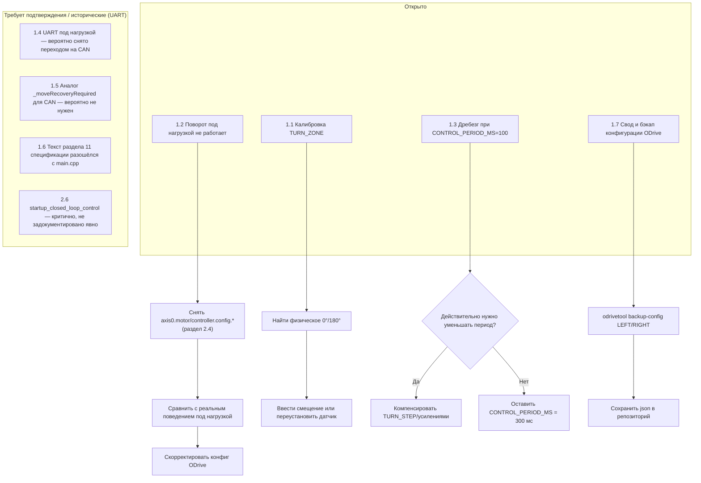

# ELLIC — рабочий журнал (worklog)

Этот документ — рабочий, не нормативный. Здесь фиксируются открытые вопросы, история их
исследования и план действий. Нормативное поведение системы описано в `ELLIC_spec.md` —
если пункт здесь противоречит спецификации, спецификация приоритетна, а этот пункт нужно
явно закрыть (перенести решение в спецификацию) или отклонить.

---

## 0. Важный контекст: смена протокола UART → CAN

Часть более ранних обсуждений и предыдущей отладки велась для архитектуры на **UART**
(модуль `ODriveUART`, ASCII-протокол ODrive, пины TX/RX на GPIO5 и др.). Актуальные
спецификация и код (`ODriveCAN.h/.cpp`) уже полностью описывают **CAN Simple** архитектуру
(TWAI, GPIO16/17, `Config.h` без UART-пинов ODrive вообще). Это значит:

- Все пункты ниже, унаследованные из UART-эпохи, помечены **[UART, требует проверки]** —
  нужно явно решить, актуальны ли они после перехода на CAN, или сняты сами собой.
- Конфигурация ODrive теперь **не отправляется с ESP32 в runtime вообще** (ни ASCII, ни
  CAN-конфигурация) — она должна быть заранее сохранена в самом ODrive через `odrivetool`
  по USB (раздел 10.2 спецификации). Раньше упомянутый баг с `InputMode.PASSTHROUGH` →
  числовое значение `5` тоже относится к этому пути конфигурации через `odrivetool`, а не к
  рантайм-коду ESP32 — эта конфигурация актуальна и переносится в раздел 2 этого документа.
- Раздел 11 спецификации (`loop()`) в текущем тексте не упоминает `odriveCAN.update()`, хотя
  он есть в `main.cpp`, и упоминает `updateConfigure()`, которого в `main.cpp` нет. Это
  расхождение зафиксировано как открытый пункт ниже (см. 1.6).

---

## 1. Открытые вопросы и задачи

### 1.1. Калибровка зон поворота (TURN_ZONE)

Зона поворота срабатывает только в определённых угловых диапазонах (±10° вокруг 0°/180°),
физически эти зоны не совпадают с ожидаемыми положениями вала. Требуется калибровка
привязки `rawAngle` AS5600 к физическим точкам механизма.

- [ ] Определить фактическое физическое положение вала в моменты, когда ожидается 0° и 180°.
- [ ] Проверить, нет ли смещения нуля AS5600 (магнит/установка датчика) или программной
      привязки в `Encoder`/`Config.h`.
- [ ] Решить: компенсировать смещение константой (например, `ANGLE_OFFSET_DEG`) или
      физической перестановкой датчика — и внести выбранный вариант в спецификацию.

### 1.2. Отказ поворота при нажатии тормоза под нагрузкой

Противоположное колесо не может повернуться, когда ELLIC стоит на полу (под нагрузкой), но
свободно крутится в поднятом состоянии. На лабораторном источнике питания заметных скачков
тока не зафиксировано — это указывает на программное ограничение со стороны ODrive
(лимиты тока/скорости/интегратора), а не на нехватку питания.

- [ ] Прочитать и зафиксировать текущие значения на обоих ODrive:
      `axis0.motor.config.current_lim`
      `axis0.controller.config.vel_gain`
      `axis0.controller.config.vel_integrator_gain`
      `axis0.controller.config.vel_integrator_limit`
      `axis0.encoder.config.enable_phase_interpolation`
      `axis0.encoder.error`
- [ ] Проверить, не упирается ли `TURN_STEP` (0.03 оборота мотора) в статическое трение
      механизма под нагрузкой при текущих `vel_gain`/`current_lim`.
- [ ] По результатам — скорректировать конфигурацию ODrive (раздел 2 этого документа) и
      зафиксировать финальные значения там же.

### 1.3. Дребезг (buzzing) без движения при уменьшении `CONTROL_PERIOD_MS`

Причина понятна: при уменьшении периода цикла управления с 300 мс до 100 мс пропорционально
уменьшается позиционная дельта за цикл; когда дельта падает ниже порога механического
трогания (stiction) механизма, колесо гудит, но не двигается.

- [ ] Решить, нужно ли вообще уменьшать `CONTROL_PERIOD_MS` (300 мс сейчас — нормативное
      значение, раздел 5 спецификации) или проблема снята сама по факту того, что менять его
      не требуется.
- [ ] Если уменьшение периода нужно по другим причинам (отзывчивость управления) — рассмотреть
      альтернативы: увеличение `TURN_STEP`/усиления при том же периоде, либо программную
      компенсацию (накопление под-порогового движения до срабатывания трогания).

### 1.4. [UART, требует проверки] Потеря UART-связи под нагрузкой

Исторический пункт из периода работы по UART: один или оба ODrive переставали отвечать
(`rx` замирал, `rx_fail` рос, `online` падал), оставаясь при этом живыми по USB. Найденные
причины (конфликт GPIO5 как strapping-пина ESP32, `uart0_protocol` 3→1, интервалы
`delay(MOVE_INTER_CMD_DELAY_MS)` в `moveWheel()`) относились к протоколу UART.

- [ ] Подтвердить, что архитектура окончательно перешла на CAN Simple (текущий код уже это
      подтверждает — `ODriveUART.h/.cpp` в переданных файлах отсутствует, есть только
      `ODriveCAN.h/.cpp`).
- [ ] Если UART-путь окончательно не используется — закрыть этот пункт как исторический,
      без переноса в код (GPIO5→GPIO27, три `delay()` в `moveWheel()` относятся к UART API и
      неприменимы к CAN-кадрам напрямую).
- [ ] Если UART всё же используется параллельно (например, для иной цели, не для управления
      ODrive) — уточнить, где именно, и перенести пункт в актуальный раздел.

### 1.5. Аналог "зависания" для CAN-канала

Раздел 13 спецификации описывает `online`/`offline` по факту получения валидных CAN-кадров
(`CAN_NODE_STALE_MS = 300 мс`), но не описывает отдельный механизм ресинхронизации протокола
(аналог прежнего `_moveRecoveryRequired` из UART-эпохи, который пересинхронизировал
запрос/ответ). Для CAN Simple, поскольку сообщения периодические и без запроса/ответа в
привычном смысле, такой механизм, вероятно, не нужен.

- [ ] Подтвердить, что `_moveRecoveryRequired` (или его аналог) не переносится в
      `ODriveCAN` и не требуется — асинхронный приём кадров и `online`/`offline` по
      таймауту это уже покрывают (раздел 13.6 спецификации).

### 1.6. Расхождение текста раздела 11 спецификации с `main.cpp`

Раздел 11 спецификации (схема `loop()`) упоминает шаг `updateConfigure()`, которого нет в
текущем `main.cpp`, и не упоминает `odriveCAN.update()`, который в `main.cpp` есть и
вызывается на каждом проходе `loop()` (приём CAN-кадров, раздел 14.1).

- [ ] Обновить текст раздела 11 спецификации, чтобы отражал фактический код: убрать
      `updateConfigure()`, добавить `odriveCAN.update()`.
- [ ] Это правка спецификации, а не кода — вносить после подтверждения, что `main.cpp`
      является источником истины (изменений в этом цикле разработки не планируется).

### 1.7. Проверка конфигурации ODrive (см. раздел 2 ниже)

Раздел 10.2 спецификации фиксирует: конфигурация ODrive выполняется заранее через
`odrivetool` и не отправляется с ESP32 в runtime. Нужно свести воедино и проверить на
обоих ODrive весь набор параметров, необходимых для корректной работы CAN Simple +
TRAP_TRAJ позиционного управления (см. раздел 2).

- [ ] Прогнать чек-лист раздела 2 по обоим ODrive (LEFT node_id=2, RIGHT node_id=1).
- [ ] Сохранить итоговый конфиг каждого ODrive (`odrivetool backup-config`) в репозиторий
      (например, `firmware/odrive_config/left.json`, `right.json`) для воспроизводимости.

---

## 2. Конфигурация ODrive (v0.5.6, CAN Simple, TRAP_TRAJ позиционное управление)

Ниже — сведённый список параметров, которые должны быть сохранены **в самом ODrive**
(`odrivetool`, через USB, заранее — раздел 10.2 спецификации). ESP32 их не отправляет.
Точные имена атрибутов приведены по документации ODrive v0.5.6; при работе в `odrivetool`
рекомендуется проверять автодополнением (`odrv0.axis0.config.<Tab>` и т.п.), так как часть
имён менялась между минорными версиями 0.5.x/0.6.x.

Выполняется **одинаково на обоих ODrive** (LEFT и RIGHT), если не указано иное.

### 2.1. node_id и CAN-шина — обязательно, разное на каждом ODrive

| Параметр | RIGHT | LEFT |
|---|---|---|
| `odrv0.axis0.config.can.node_id` | `1` | `2` |
| `odrv0.can.config.baud_rate` | `250000` | `250000` |

После смены `node_id` требуется `odrv0.save_configuration()` и `odrv0.reboot()`.

### 2.2. Периодичность CAN-сообщений диагностики (rate_ms)

Спецификация (раздел 12.0, 16) требует, чтобы циклически приходили: Heartbeat (`0x01`,
включён всегда по умолчанию), Motor Error (`0x03`), Encoder Error (`0x04`), Encoder
Estimates (`0x09`), Iq (`0x14`), Bus Voltage/Current (`0x17`), Controller Error (`0x1D`).
Нулевой `rate_ms` отключает сообщение — все нужные должны быть **ненулевыми**.

| Параметр (ориентировочное имя для fw 0.5.6) | Рекомендуемое значение |
|---|---|
| `axis0.config.can.heartbeat_rate_ms` | обычно фиксирован/не требует правки (проверить) |
| `axis0.config.can.encoder_rate_ms` | `100` |
| `axis0.config.can.motor_error_rate_ms` (или аналог для 0x03) | ненулевое, например `100`–`1000` |
| `axis0.config.can.encoder_error_rate_ms` (для 0x04) | ненулевое |
| `axis0.config.can.controller_error_rate_ms` (для 0x1D) | ненулевое |
| `axis0.config.can.iq_rate_ms` | `100` (см. `iq_rate_ms` в спецификации, раздел 12.0) |
| `axis0.config.can.bus_voltage_rate_ms` (для 0x17) | `100` (см. `bus_vi_rate_ms` в спецификации) |

**Важно:** точные имена полей под error-сообщения (0x03/0x04/0x1D) для fw 0.5.6 нужно
подтвердить автодополнением в `odrivetool` — в разных подверсиях 0.5.x они могли называться
иначе, чем в более новой документации 0.6.x (там часть переименована в `..._msg_rate_ms`).

### 2.3. Управление и режим позиционирования (согласуется с разделом 9 спецификации)

| Параметр | Значение | Комментарий |
|---|---|---|
| `axis0.controller.config.control_mode` | `CONTROL_MODE_POSITION_CONTROL` (`3`) | приём `Set Input Pos` |
| `axis0.controller.config.input_mode` | `INPUT_MODE_TRAP_TRAJ` (**числом `5`**, не `InputMode.PASSTHROUGH`) | подтверждено в этом проекте как исправленный баг — ASCII/CAN Simple протокол ODrive принимает только числовые значения |
| `axis0.trap_traj.config.vel_limit` | по механике/безопасности | ограничивает скорость перемещения к цели в TRAP_TRAJ |
| `axis0.trap_traj.config.accel_limit` | по механике | |
| `axis0.trap_traj.config.decel_limit` | по механике | |
| `axis0.controller.config.vel_limit` | должен быть ≥ `trap_traj.config.vel_limit` | общий лимит скорости контроллера |

### 2.4. Токовые/скоростные лимиты и усиления — центральное место для пункта 1.2 (поворот под нагрузкой)

| Параметр | Комментарий |
|---|---|
| `axis0.motor.config.current_lim` | проверить, не занижен ли относительно нужного момента на TURN_STEP под нагрузкой |
| `axis0.controller.config.vel_gain` | слишком малое значение → вялая/неспособная преодолеть трение реакция |
| `axis0.controller.config.vel_integrator_gain` | накопление ошибки скорости; влияет на способность "дожать" короткое приращение TURN_STEP |
| `axis0.controller.config.vel_integrator_limit` | ограничение интегратора — если занижено, тоже может не дать "дожать" под нагрузкой |
| `axis0.controller.config.pos_gain` | позиционное усиление (TRAP_TRAJ всё равно идёт через позиционный контур) |

Эти пять параметров — прямые кандидаты на объяснение проблемы 1.2 и должны быть сняты и
записаны с реального железа перед изменением.

### 2.5. Энкодер мотора ODrive (Hall, встроенный в мотор-колесо)

Раздел 1 спецификации явно упоминает Hall-датчик мотора (42 такта/оборот), хотя и не
используется для расчётов в ESP32 — но ODrive использует его для коммутации/оценки
скорости своей оси.

| Параметр | Значение | Комментарий |
|---|---|---|
| `axis0.encoder.config.mode` | `ENCODER_MODE_HALL` | если используется штатный Hall-датчик мотора |
| `axis0.encoder.config.cpr` | `42` | 7 пар полюсов × 6 состояний Hall |
| `axis0.encoder.config.enable_phase_interpolation` | проверить текущее значение (пункт 1.2) | влияет на сглаживание при низком разрешении Hall |
| `axis0.encoder.error` | только диагностика | зафиксировать текущее значение, не параметр конфигурации |

### 2.6. Автономный старт без ESP32-конфигурации (критично для раздела 10.2 спецификации)

Поскольку по разделу 10.2 спецификации ESP32 **не отправляет** команды перехода в закрытый
цикл (`AxisState.CLOSED_LOOP_CONTROL`) в runtime, ODrive должен делать это самостоятельно
при подаче питания:

| Параметр | Значение | Комментарий |
|---|---|---|
| `axis0.config.startup_closed_loop_control` | `True` | иначе после включения ODrive останется в IDLE и не будет реагировать на Set Input Pos |

**[Открыто]** Этот параметр не упомянут явно в тексте спецификации — нужно подтвердить, что
он действительно выставлен на обоих ODrive, и при подтверждении добавить явным пунктом в
`ELLIC_spec.md` (раздел 10), так как это критично для работы всей системы по CAN-only схеме.

### 2.7. Watchdog — явно выключен (раздел 13.2 спецификации, уже решено)

| Параметр | Значение |
|---|---|
| `axis0.config.enable_watchdog` | `False` |

Решение уже зафиксировано в спецификации (раздел 13.2) — включён здесь для полноты чек-листа
конфигурации, действий не требует.

### 2.8. Общие ограничения платы (проверить, не входят в предмет данной спецификации, но нужны для безопасной работы)

| Параметр | Комментарий |
|---|---|
| `odrv0.config.dc_bus_undervoltage_trip_level` | под используемую батарею/БП |
| `odrv0.config.dc_bus_overvoltage_trip_level` | под используемую батарею/БП |
| `odrv0.config.dc_max_positive_current` | суммарный лимит потребления |
| `odrv0.config.dc_max_negative_current` | лимит рекуперации (может быть `0`, если рекуперация не нужна/не поддерживается питанием) |
| `odrv0.axis0.motor.config.motor_type` | обычно `MOTOR_TYPE_HIGH_CURRENT` для мотор-колёс |
| `odrv0.axis0.motor.config.pole_pairs` | по паспорту мотора |

---

## 3. Диаграмма состояния задач

---

## 4. История решённых вопросов (перенесено из примечаний спецификации)

Ниже — обсуждение, которое привело к текущим нормативным решениям в `ELLIC_spec.md`
(разделы 4, 10.4, 12.0, 16). Сохранено как история, самих решений это не меняет.

### Вопрос 1 — диагностика (решено)

Для ODrive v0.5.6:

| Параметр CAN Simple | Payload |
|---|---|
| `axis0.error` — `0x01` Heartbeat | Axis_Error = uint32 |
| `axis0.motor.error` — `0x03` Get Motor Error | uint32 |
| `axis0.controller.error` — `0x1D` Get Controller Error | uint32 |
| `Iq` — `0x14` Get Iq | Iq_Setpoint + Iq_Measured, два float |
| `Vel_Estimate` — `0x09` | второй float (вместе с Pos_Estimate) |
| Bus Voltage/Current — `0x17` | два float |

CAN Simple ODrive v0.5.6 добавил циклические сообщения для motor error, controller error,
Iq и Bus Voltage/Current. **Vq отдельного CAN Simple сообщения в v0.5.6 нет** — его не нужно
придумывать.

Итоговое решение для `TelemetrySample`: `axisError`, `motorError`, `controllerError`, `Iq`,
`Vel_Estimate`, `BusVoltage`, `BusCurrent`. `Vq` **удалён** из спецификации. Для `Iq`
используется `Iq_Measured` как фактический ток мотора; `BusCurrent` — отдельно, это ток
потребления от DC-шины. `0x14` передаёт Setpoint и Measured Iq, `0x17` — Bus Voltage и Bus
Current. Для циклической передачи достаточно задать ненулевые `rate_ms` для `0x03`, `0x1D`,
`0x14` и `0x17`; нулевой `rate_ms` отключает сообщение.

### Вопрос 2 — Procedure_Result (решено)

Для ODrive firmware v0.5.6 `Procedure_Result` в Heartbeat нет. Heartbeat v0.5.6 содержит:
`Axis_Error`, `Axis_State`, `Motor_Error_Flag`, `Encoder_Error_Flag`,
`Controller_Error_Flag`, `Trajectory_Done_Flag`. Отдельный CAN ID для `Procedure_Result`
искать не нужно — он и не требуется для задачи.

Решение: `Procedure_Result` **удалён** из спецификации и из `OdriveSnapshot`. Оставлены:
`axisState`, `axisError`, `motorError`, `encoderError`, `controllerError`, `trajectoryDone`.
При этом `motorError`, `encoderError`, `controllerError` получаются отдельными сообщениями
`0x03`, `0x04`, `0x1D`. Это соответствует именно v0.5.6, а не более новым описаниям CAN — в
changelog v0.5.6 отдельно указано, что Heartbeat получил флаги ошибок, а сами ошибки нужно
получать соответствующими сообщениями.

### Вопрос 3 — ESP32 CAN (решено)

Решено освободить старые UART-пины и использовать их под CAN:

- ESP32 GPIO16 → SN65HVD230 TX
- ESP32 GPIO17 ← SN65HVD230 RX

Это нормальная разводка для ESP32 TWAI и не затрагивает: AS5600 (GPIO21/22), тормоза
(GPIO32/33), джойстик GPIO27, старые UART-пины (больше не нужны).

**CAN bitrate: 250 kbit/s** — выбран сознательно вместо 500 kbit/s: для двух ODrive и
небольшого объёма телеметрии этого достаточно, вариант консервативнее.

CAN ID формируется стандартно: `CAN_ID = (node_id << 5) | command_id`. Для RIGHT (node_id=1)
физические ID: Heartbeat = `0x21`, Encoder = `0x29`, Input Position = `0x2C`, Iq = `0x34`,
Bus V/I = `0x37`, Motor Error = `0x23`, Controller Err = `0x3D`. Для LEFT (node_id=2) —
соответственно `0x40 + command_id`.

**Итого зафиксировано в спецификации** (перенесено в `ELLIC_spec.md`, разделы 4 и 16):
CAN — ESP32 TWAI, TX=GPIO16, RX=GPIO17, bitrate=250000 бит/с, transceiver=SN65HVD230.
ODrive diagnostics: `0x01` Heartbeat, `0x03` Motor Error, `0x04` Encoder Error, `0x09`
Encoder Estimates, `0x14` Iq, `0x17` Bus Voltage/Current, `0x1D` Controller Error. Удалено:
Vq, Procedure_Result.
